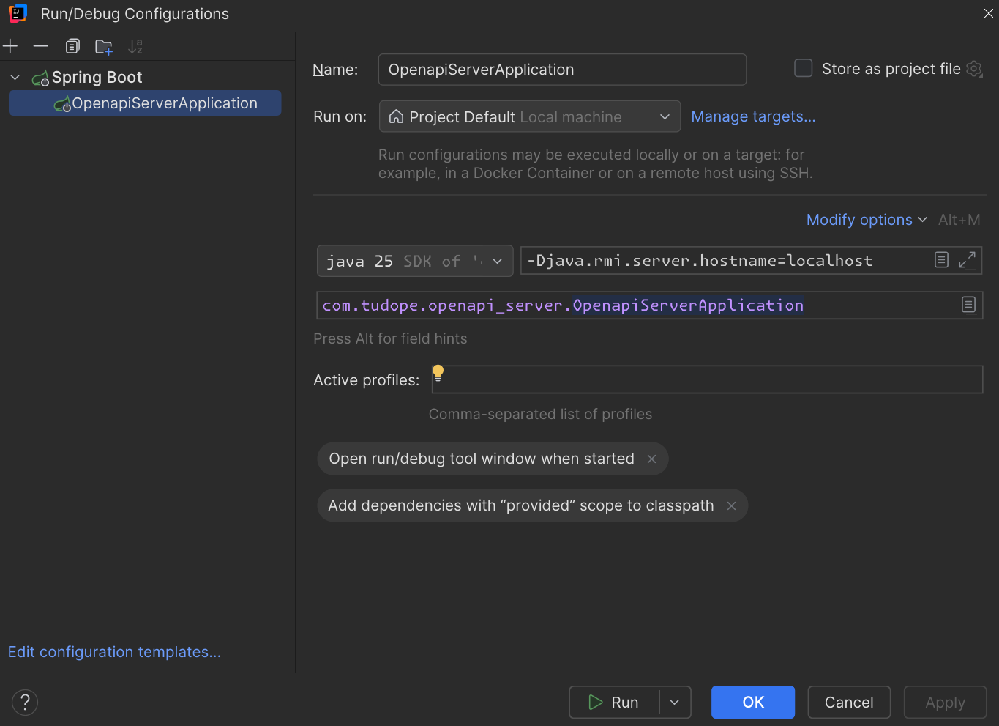

# Tanstack Start + Spring Boot Demo

This repository is a working demo of a full-stack application:

- Tanstack Start + React Query + React Hook Form
- Orval (OpenAPI code generator for TypeScript)
- Spring Boot + OpenAPI + Session-based auth
- ElectricSQL (Real-time support for PostgreSQL)

## Roadmap

- [x] Complex translation system
- [x] Liquibase + PostgreSQL
- [x] Memory optimization and profiling for Spring Boot application
- [x] Cookie authentication: Either same-site or cross-site cookies (with proxy server on client)
  - [x] Server APIs
  - [x] Client sign-in + sign-up pages (React Hook Form)
  - [x] Integrate forms with APIs
- [x] Handle accessibility (Check Lighthouse in Chrome Devtools for suggestions)
- [x] Real-time support: Setup ElectricSQL for this project template
  1. Way 1: Pure Socket + STOMP support
  2. Way 2: ElectricSQL sync engine or other similar open-source
  3. Way 3: Convex
- [x] ElectricSQL authentication
- [x] Deployment
  - [x] Render
    - [x] electric-server
    - [x] admin-monitor
    - [x] openapi-server
    - [x] tanstack-start-client-app: https://tanstack-start-client-app.onrender.com
  - [x] Neon (PostgreSQL with easy logical replication support, but need to be careful with scale down to zero)
    - Need to set ELECTRIC_REPLICATION_IDLE_TIMEOUT, so Electric can scale down
    - To prevent storage bloat, Neon automatically removes inactive replication slots after approximately 40 hours
  - [x] Github Actions: For running free cron jobs
    - Wake up ElectricSQL server for example (if you set ELECTRIC_REPLICATION_IDLE_TIMEOUT to scale down after certain
      idle time)

## Running the application

Client (Tanstack Start):

```bash
cd tanstack-start-client-app
pnpm install
pnpm copy-env
pnpm dev
```

Server (Spring Boot):

- I prefer using IntelliJ to run the server
- But you can also use VSCode to run
- But before running the server, make sure to run docker compose properly and copy environment variables

```bash
cd openapi-server
pnpm install
pnpm copy-env
docker compose up -d
```

## Features

Tanstack Start:

- React Query: Data fetching and caching
- Orval: Type-safe API client generation from OpenAPI spec
- ElectricSQL client: Real-time read path with PostgreSQL
  - NOTE: I haven't implemented true local-first approach to support real-time write path yet

- MobX: State management for UI state
- React Hook Form: My own convention of composing nested independent forms + monitoring form states

- CSS modules + Tailwind
- Theme provider with system theme support and FOUC prevention

- Translation support with react-i18next
- Test ID naming ([See doc](./docs/tanstack/test-ids.md))

Spring Boot:

- OpenAPI: API documentation and contract
- Security: Basic auth, CSRF protection for SPA, and CORS configuration
- ElectricSQL proxy server: A proxy layer between client and ElectricSQL server to handle authentication and filtering

- Spring Audit: Auditing entity with @CreatedBy createdAt, @LastModifiedBy updatedAt,
  etc. ([See doc](./docs/spring/audit.md))
- Liquibase: Database migrations ([See doc](./docs/spring/liquibase.md))

- Testing: Unit tests with Surefire and integration tests with Failsafe (Bonus: Testcontainers for running PostgreSQL
  Docker containers during tests) ([See doc](./docs/spring/testing.md))

- Memory optimization + Profiling: ([See doc](docs/spring/memory-profiling.md))

## Structure

`openapi-server`: Spring Boot application

- `src/main/java/com/tudope/openapi_server`: Java source code
- `src/main/resources/db/changelog`: Liquibase changelog files
- `src/main/resources/application.yaml`: Application configuration (with multiple profile variants)
- `src/test/java/com/tudope/openapi_server`: Java test code
- `docker-compose.yaml`: Docker compose config for PostgreSQL and ElectricSQL server
- `pom.xml`: Maven build file + dependencies

---

`tanstack-start-client-app`: Tanstack Start application

- `public`: Static assets

- `src/api/axios.ts`: Override Axios instance
- `src/api/fetch.ts`: Override Fetch instance

- `src/components`: Pure React components without any data
- `src/electric-shapes`: ElectricSQL shape definitions
- `src/features`: Feature-specific components and logic
- `src/orval`: Generated API client code thanks to Orval

- `src/providers/csrf-provider.tsx`: CSRF token provider making sure the app has initialized CSRF token
- `src/providers/store-provider.tsx`: MobX store provider
- `src/providers/theme-provider.tsx`: Theme provider to manage light/dark/system theme and prevent FOUC

- `src/routes/__root.tsx`: Root route of the app
- `src/routes/index.tsx`: Home route
- `src/routes/_authenticated/app.tsx`: App route after user has signed in
- `src/routes/_unauthenticated/signin.tsx`: Sign-in route
- `src/routes/_unauthenticated/signup.tsx`: Sign-up route

- `src/server-actions`: Global server actions
- `src/stores`: MobX stores for UI state management
- `src/styles`: Global style + route-level styles
- `src/utils`: Utility functions for class names, tailwind, etc.
- `src/router.tsx`: Application router configuration
- `orval.config.ts`: Orval configuration file to generate API client from OpenAPI spec

## Issues

- For CSS file to not complain about "Unknown at rule" when using Tailwind directives in VSCode:
  - Install `Tailwind CSS IntelliSense` extension in VSCode
  - Add file association in VSCode settings -> `"css": "tailwindcss"`

- For IntelliJ TypeScript support to function properly, make sure you are not marking `node_modules` as "Excluded"
  - `node_modules` needs to be automatically marked by IntelliJ as "library root"

- For IntelliJ Spring Boot in Windows WSL2 to show Beans, Health, Mappings, and Environment properly
  - Make sure you change the run configuration to include `-Djava.rmi.server.hostname=localhost`


